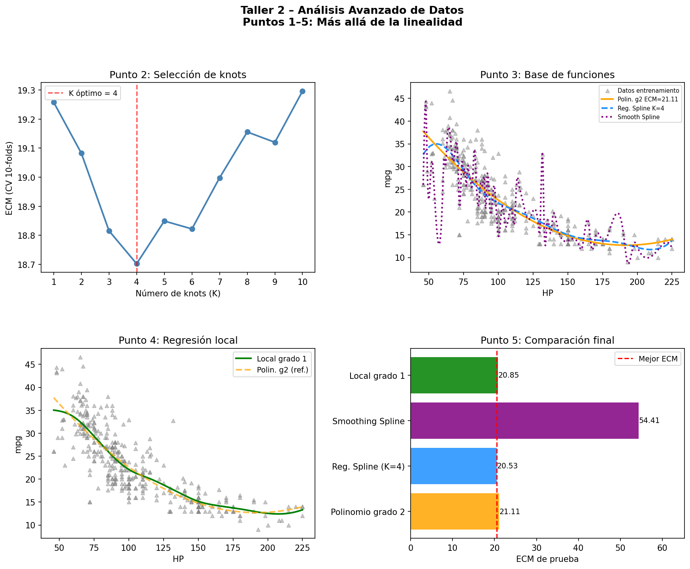
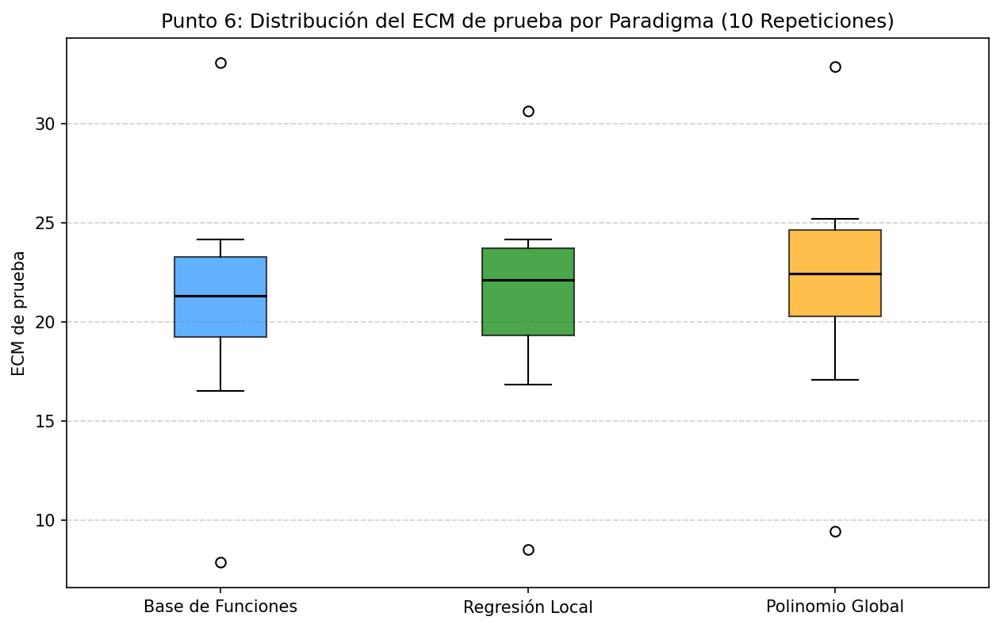

# Taller 2 – Análisis Avanzado de Datos
## Más allá de la linealidad: Splines y Regresión Local

**Curso:** Análisis Avanzado de Datos  
**Profesor:** Nicolás López  
**Estudiantes:** Sara Castillejo, Stefany Mojica y Juan Rodríguez  
**Maestría:** Matemáticas Aplicadas y Ciencias de la Computación  
**Semestre:** 2026/1  
**Universidad:** Universidad del Rosario  
**Repositorio:** https://github.com/jrodriguez-dev/paradigmas-no-lineales-para-predecir-millas-por-galon-ISLR2
---

## Descripción

En este taller trabajamos con el dataset `Auto` (ISLR2), donde **queremos predecir el rendimiento de un carro (mpg, millas por galón) a partir de su potencia (horsepower)**. Al graficar esos datos, vemos que la relación tiene forma de curva: los carros con poca potencia son muy eficientes y, a medida que sube la potencia, el rendimiento cae, pero no de forma pareja — cae rápido al principio y luego se estabiliza.

Una línea recta no puede capturar eso bien, y por eso su error de predicción es alto (ECM ≈ 22). Entonces la pregunta que intentamos responder es: **¿cuál es la mejor manera de ajustar una curva a esos datos, de forma que prediga bien en datos nuevos que el modelo nunca vio?**
Para responderla exploramos tres métodos distintos:

1. **Base de funciones (polinomios y splines):** se construye una curva matemática flexible dividiendo el rango de HP en segmentos y ajustando polinomios que empalman suavemente entre sí.
2. **Regresión local:** en lugar de ajustar una curva global, se ajusta un modelo pequeño en cada punto usando solo los datos vecinos.
3. **Polinomio global:** la referencia más simple, que extiende la línea recta a una curva con un solo polinomio para todos los datos.

No basta con que el modelo se ajuste bien a los datos que ya conoce: Lo importante es que prediga bien datos nuevos. Por eso usamos validación cruzada y un conjunto de prueba separado para medir el error real de generalización de cada método. 

Al final, lanzamos el experimento 10 veces para elegir el método que mejor resuelve este problema comparando el promedio y dispersión de cada uno. 

## Archivos

| Archivo            | Descripción                                                 |
| ------------------ | ----------------------------------------------------------- |
| `taller2.py`       | Script Python con la solución completa de los puntos 1 al 6 |
| `requirements.txt` | Dependencias de Python                                      |

## Métodos implementados

- **Punto 1:** Separación entrenamiento/prueba (90/10) con semilla fija
- **Punto 2:** Selección de knots óptimos (K=1..10) por CV 10-folds — Regression Spline
- **Punto 3:** Comparación por CV 10-folds: Polinomio grado 2, Smoothing Spline, Regression Spline
- **Punto 4:** Regresión local (Nadaraya-Watson) con kernel gaussiano, grado 1 vs 2
- **Punto 5:** Evaluación final sobre datos de prueba externos
- **Punto 6:** Obtener 10 ECM de prueba para cada paradigma de modelamiento y elegir el mejor.

## Cómo ejecutar

```bash
python -m venv venv # crear ambiente virtual. *opcional, recomendado
source venv/Scripts/activate # activar ambiente virtual. *opcional, recomendado
pip install -r requirements.txt # instalar dependencias
python taller2.py # ejecutar código
```

---

## Resultados

### Punto 1 – Separación de datos

Se divide aleatoriamente el dataset Auto (392 observaciones) en **90 % entrenamiento (352)** y **10 % prueba (40)** con semilla fija para reproducibilidad.

### Punto 2 – Selección del número óptimo de knots

Se evalúa el ECM por validación cruzada (10-folds) para $K = 1, ..., 10$ knots igualmente espaciados en el rango de horsepower.

| K     | ECM (CV)             |
| ----- | -------------------- |
| 1     | 19.2579              |
| 2     | 19.0825              |
| 3     | 18.8154              |
| **4** | **18.7018** ← óptimo |
| 5     | 18.8491              |
| 6     | 18.8218              |
| 7     | 18.9979              |
| 8     | 19.1557              |
| 9     | 19.1201              |
| 10    | 19.2963              |

**Resultado:** $K = 4$ knots minimiza el ECM de validación cruzada.

### Punto 3 – Comparación de modelos basados en base de funciones

Se comparan tres modelos por CV 10-folds:

| Modelo                | ECM (CV 10-folds) |
| --------------------- | ----------------- |
| Polinomio grado 2     | 19.0162           |
| Smoothing Spline      | 33.1108           |
| **Reg. Spline (K=4)** | **18.7018**       |

**Modelo seleccionado:** Regression Spline con $K = 4$ knots.

### Punto 4 – Regresión local (Nadaraya-Watson)

Se comparan grados 1 y 2 del polinomio local con kernel gaussiano (ancho de banda por regla de Silverman):

| Grado | ECM (CV 10-folds) |
| ----- | ----------------- |
| **1** | **18.6540**       |
| 2     | 18.7327           |

**Grado óptimo:** 1 (regresión local lineal).

### Punto 5 – Evaluación final sobre datos de prueba

Se ajustan los cuatro modelos sobre todo el entrenamiento y se evalúa el ECM en el 10 % de prueba externo:

| Modelo                | ECM de prueba |
| --------------------- | ------------- |
| Polinomio grado 2     | 21.1061       |
| **Reg. Spline (K=4)** | **20.5315**   |
| Smoothing Spline      | 54.4134       |
| Local grado 1         | 20.8462       |

**Mejor modelo:** Regression Spline con $K = 4$ knots (ECM = 20.53).

### Gráficas de los Puntos 2–5



---

## Justificación y Resultados Finales (Punto 6)

Para asegurar que la elección del "mejor" modelo no fuera producto del azar de una sola partición de datos, realizamos una simulación de **10 repeticiones independientes**. En cada iteración, se generó una nueva partición (90% entrenamiento / 10% prueba) y se re-evaluaron los tres paradigmas principales desde cero (incluyendo la selección de hiperparámetros óptimos por validación cruzada).

Los resultados de error cuadrático medio (ECM) de prueba consolidados fueron:

| Paradigma                       | ECM Promedio (10 iter) | Desviación Estándar |
| ------------------------------- | ---------------------- | ------------------- |
| **Base de Funciones (Splines)** | **20.93**              | 6.36                |
| **Regresión Local (LOESS)**     | 21.11                  | 5.78                |
| **Polinomio Global (Grado 2)**  | 21.92                  | 6.09                |



**Conclusión del experimento:**
Seleccionamos el acercamiento basado en **Base de Funciones** (específicamente el *Regression Spline* con el número óptimo de *knots*) como el modelo superior para este problema. 

Aunque la Regresión Local es altamente flexible y competitiva, el uso de Splines ofrece un balance óptimo entre sesgo y varianza. No solo logra el menor error de predicción en promedio, sino que captura de forma más robusta la curvatura real del dataset `Auto`, demostrando ser el paradigma más estable para predecir el rendimiento (`mpg`) en función de la potencia (`horsepower`).

## Problema 2 (20 pts)

En el contexto del análisis de datos funcionales, abordamos la estimación de curvas subyacentes a partir de observaciones discretas y ruidosas mediante regresión no paramétrica.

### (7) Estimador de Nadaraya-Watson para la $i$-ésima unidad estadística

Para una unidad estadística individual $i$, el estimador se construye utilizando únicamente sus $n_i$ observaciones discretizadas $x_{i1}, ..., x_{in_i}$ evaluadas en los puntos $t_{i1}, ..., t_{in_i}$. El estimador de Nadaraya-Watson evaluado en un punto arbitrario $t$ se define como:

$$\hat{x}_i(t) = \frac{\sum_{j=1}^{n_i} K\left(\frac{t - t_{ij}}{h}\right) x_{ij}}{\sum_{j=1}^{n_i} K\left(\frac{t - t_{ij}}{h}\right)}$$

Donde $K(\cdot)$ es una función Kernel y $h$ es el parámetro de suavizado.

### (8) Estimador de Nadaraya-Watson para la función media $\hat{\mu}(t)$

Para estimar la centralidad de los datos funcionales, asumimos la existencia de una función aleatoria subyacente $\mu(t)$. Extendiendo el estimador anterior y agrupando (*pooling*) las observaciones de los $N$ individuos en la colección, la función media en $t$ se calcula mediante una doble sumatoria:

$$\hat{\mu}(t) = \frac{\sum_{i=1}^{N} \sum_{j=1}^{n_i} K\left(\frac{t - t_{ij}}{h_{\mu}}\right) x_{ij}}{\sum_{i=1}^{N} \sum_{j=1}^{n_i} K\left(\frac{t - t_{ij}}{h_{\mu}}\right)}$$

## Referencias

- James et al. *An Introduction to Statistical Learning with R*, 2a ed., Cap. 7
- Hastie et al. *The Elements of Statistical Learning*, Cap. 5 y 9
- López, N. *Sesión 3: Más allá de la linealidad*, AAD 2026
